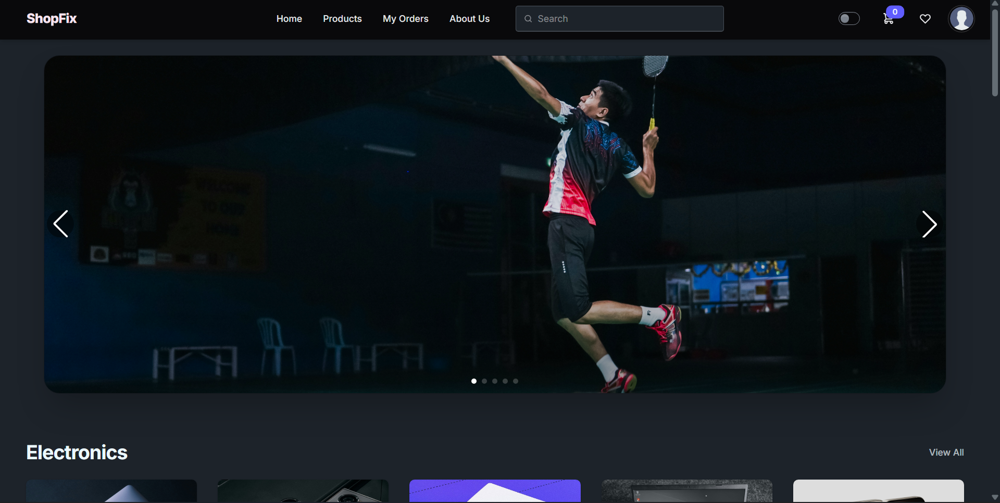
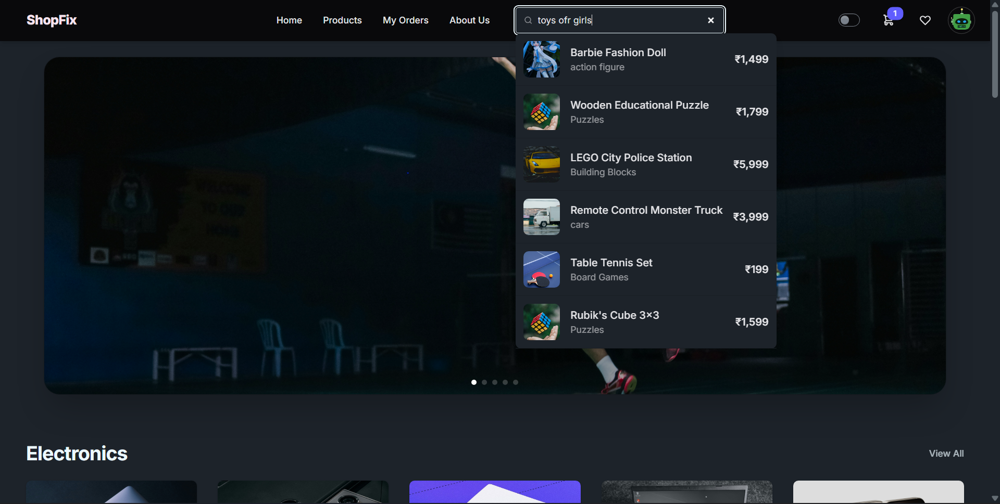
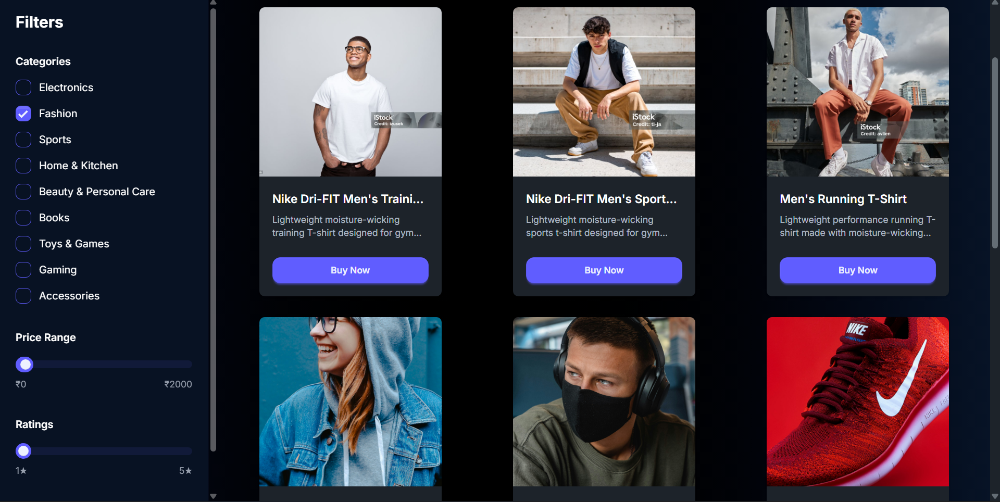
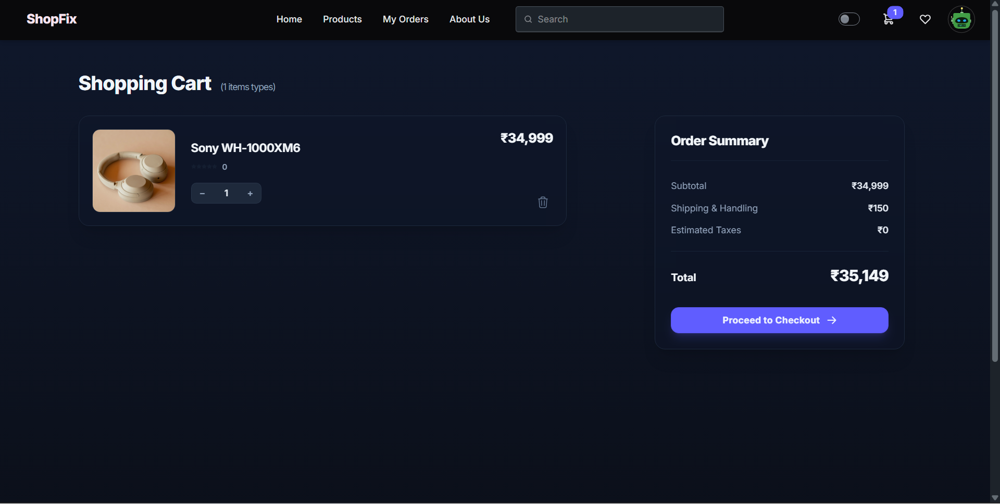
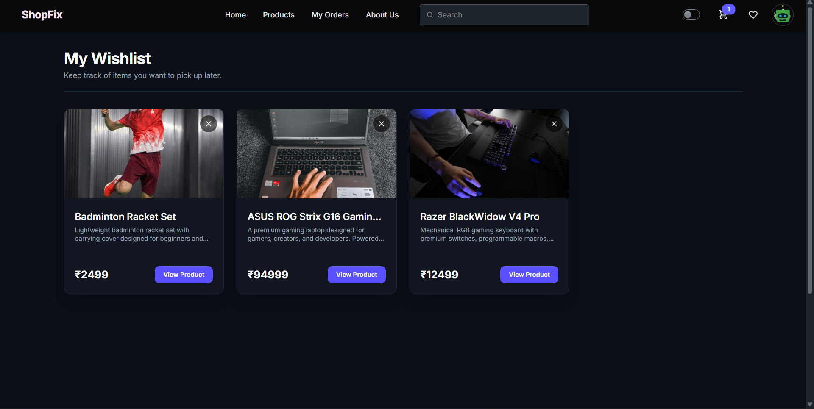
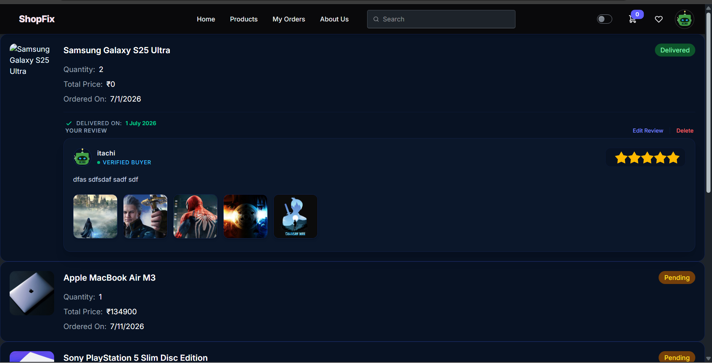
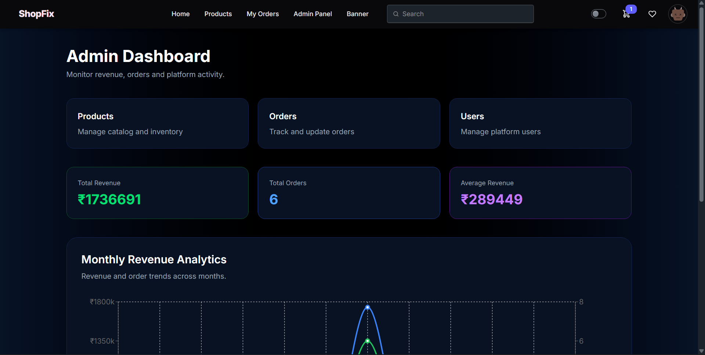
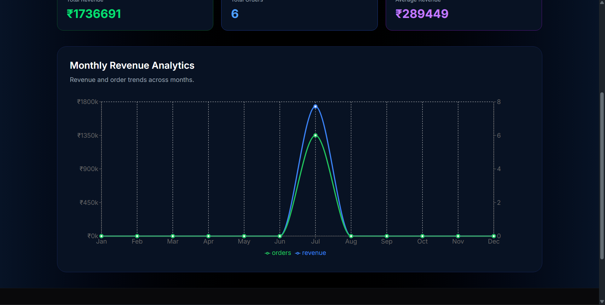

# 🛒 ShopFix


<p align="center">
  <b>A Modern Full-Stack MERN E-Commerce Platform</b>
</p>

<p align="center">
Built using React, Redux Toolkit, Node.js, Express.js, MongoDB, JWT Authentication, Google Gemini AI, Cloudinary, Tailwind CSS, and Recharts.
</p>

---

## 🚀 Live Demo

🌐 **Live Website:**  
[Visit ShopFix](https://shop-fix-qwen.vercel.app/)

🎥 **Demo Video:**  
[Watch Live Demo](https://drive.google.com/file/d/1Kj1F4VJknpVZhnwIcJMzZPG5IIZuBjxE/view?usp=drive_link)

---

# 📖 About ShopFix

ShopFix is a production-ready full-stack MERN e-commerce application designed to deliver a modern online shopping experience with secure authentication, intelligent product discovery, scalable backend architecture, and an intuitive admin dashboard.

The application allows users to browse products, search using AI-powered recommendations, manage shopping carts and wishlists, place orders, review purchased products, and track their orders.

Alongside the customer-facing application, ShopFix also provides a complete admin panel with analytics, product management, order management, category management, banner management, and user management.

The primary objective of this project was to build a scalable real-world MERN application while learning production-level backend development, authentication, deployment, state management, API design, and performance optimization.

---

# ✨ Features

## 🔐 Authentication & Security

- JWT Authentication
- Refresh Token Authentication
- Secure HTTP-Only Cookie Authentication
- OTP Email Verification
- Persistent Login Sessions
- Protected Routes
- Role-Based Authorization (Admin/User)
- Automatic Token Refresh
- Secure Logout

---

## 🛍️ Shopping Experience

- Browse Products
- Product Details
- Product Variants
- Product Gallery
- Shopping Cart
- Wishlist
- Product Reviews
- Verified Buyer Reviews
- Review Images
- Product Ratings
- Quantity Management
- Responsive Design
- Dark Mode

---

## 💳 Payment & Checkout

- Secure Online Payments using Stripe
- Payment Verification
- Checkout Flow
- Order Creation after Successful Payment
- Failed Payment Handling

## 🤖 AI Features

- Google Gemini AI Product Recommendation Chat
- AI-Assisted Product Discovery
- Intelligent Product Suggestions
- Context-Aware Product Recommendations

---

## 🔍 Search & Filtering

- Real-Time Search Suggestions
- Product Search
- Category Filtering
- Price Filtering
- Rating Filtering
- Sorting Products

---

## 📦 Order Management

- Place Orders
- Order History
- Order Tracking
- Order Status Updates
- Cancel Orders
- Review Purchased Products

---

## 🛠️ Admin Features

- Admin Dashboard
- Revenue Analytics
- Monthly Sales Analytics
- Order Management
- Product Management
- User Management
- Banner Management
- Category Management
- Inventory Management

---

## ⚡ Performance Optimizations

- Lazy Loading
- Code Splitting
- Axios Interceptors for Automatic Token Refresh
- Optimized API Calls
- Redux Toolkit Global State Management
- Efficient Database Queries
- Race Condition Handling for Critical Operations

---

## 🧠 Backend Architecture

- RESTful API Design
- MVC Architecture
- Centralized Error Handling
- Async Middleware
- MongoDB Aggregation Pipelines
- Secure Cookie-Based Authentication
- Hierarchical Category System
- Cloudinary Image Management
- Email Notifications using Nodemailer

---

# 🛠 Tech Stack

## Frontend

- React
- Redux Toolkit
- React Router DOM
- Axios
- Tailwind CSS
- DaisyUI
- Swiper.js
- Recharts

---

## Backend

- Node.js
- Express.js
- MongoDB
- Mongoose
- JWT
- Cookie Parser
- Multer
- Cloudinary
- Nodemailer
- Google Gemini API

---

## Deployment

- Vercel
- Render

---

# 📸 Application Screenshots

## 🏠 Home Page

A modern landing page showcasing featured products, categories, banners, and AI-powered shopping experience.



---

## 🔍 AI Product Search

Search products using intelligent search powered by Google Gemini AI with context-aware recommendations.



---

## 📦 Product Details

View detailed product information including variants, image gallery, ratings, reviews, stock availability, and related products.



---

## 🛒 Shopping Cart

Manage cart items with quantity controls, price calculations, and seamless checkout preparation.



---

## ❤️ Wishlist

Save products for future purchases with a personalized wishlist.



---

## 📦 Order History

Track previous orders, order status, purchased products, and manage reviews.



---

## 🛠️ Admin Dashboard

A centralized dashboard for managing products, users, categories, banners, and customer orders.



---

## 📈 Revenue Analytics

Interactive analytics dashboard displaying revenue trends and business insights using MongoDB Aggregation Pipelines and Recharts.



---

# ⚙️ Installation

## Clone the Repository

```bash
git clone https://github.com/YOUR_GITHUB_USERNAME/ShopFix.git
```

Move into the project directory

```bash
cd ShopFix
```

---

## Install Frontend Dependencies

```bash
cd frontend
npm install
```

Run the frontend

```bash
npm run dev
```

---

## Install Backend Dependencies

```bash
cd ../backend
npm install
```

Run the backend

```bash
npm run dev
```

---

# 🔑 Environment Variables

Create a `.env` file inside the **backend** directory and add the following variables:

```env
PORT=

MONGO_URI=

JWT_SECRET=

JWT_REFRESH_SECRET=

ACCESS_TOKEN_EXPIRY=

REFRESH_TOKEN_EXPIRY=

CLOUDINARY_CLOUD_NAME=

CLOUDINARY_API_KEY=

CLOUDINARY_API_SECRET=

EMAIL=

PASSWORD=

GEMINI_API_KEY=

FRONTEND_URL=
```

---

# 📂 Project Structure

```
ShopFix
│
├── frontend
│   ├── src
│   │   ├── assets
│   │   ├── components
│   │   ├── pages
│   │   ├── redux
│   │   ├── hooks
│   │   ├── layouts
│   │   ├── routes
│   │   ├── services
│   │   ├── utils
│   │   └── App.jsx
│   │
│   └── public
│
├── backend
│   ├── config
│   ├── controllers
│   ├── middleware
│   ├── models
│   ├── routes
│   ├── services
│   ├── utils
│   ├── validations
│   └── server.js
│
└── screenshots
```

---

# 🏗️ Project Architecture

```
                    User
                      │
                      ▼
                React Frontend
                      │
          Redux Toolkit + Axios
                      │
      Axios Interceptors (JWT Refresh)
                      │
                      ▼
             Express REST API
                      │
     ┌────────────────┼────────────────┐
     │                │                │
     ▼                ▼                ▼
 MongoDB         Cloudinary      Gemini AI
(Database)      (Image Storage)  (Recommendations)
     │
     ▼
Nodemailer (OTP Verification)
```

---

# 🔄 Authentication Flow

```text
User Login
      │
      ▼
Access Token + Refresh Token Generated
      │
      ▼
Stored as HTTP-Only Cookies
      │
      ▼
Frontend Makes API Request
      │
      ▼
Access Token Expired?
      │
 ┌────┴────┐
 │         │
No        Yes
 │         │
 ▼         ▼
Continue  Axios Interceptor
              │
              ▼
      Refresh Access Token
              │
              ▼
Retry Original Request Automatically
```

---

# 🌟 Key Highlights

- 🔐 Secure JWT Authentication with Refresh Tokens
- 🔄 Automatic Token Refresh using Axios Interceptors
- 🤖 Google Gemini AI Product Recommendation Chat
- 🧠 AI-Powered Product Search
- 🛍️ Complete Shopping Experience
- ❤️ Wishlist & Cart Management
- ⭐ Advanced Review System with Image Uploads
- 📂 Hierarchical Category Management
- 📊 Revenue Analytics Dashboard
- 🛠️ Comprehensive Admin Panel
- ☁️ Cloudinary Image Management
- 📧 OTP Email Verification
- ⚡ Lazy Loading & Code Splitting
- 🏎️ Optimized Database Queries
- 🔒 Race Condition Handling
- 🌙 Responsive Dark Mode UI
- 🚀 Production Deployment on Vercel & Render